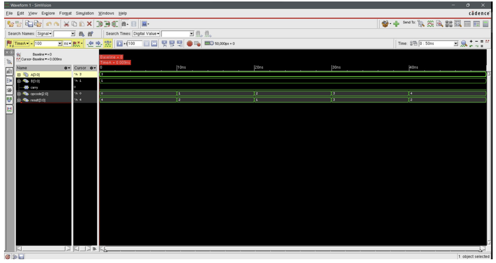
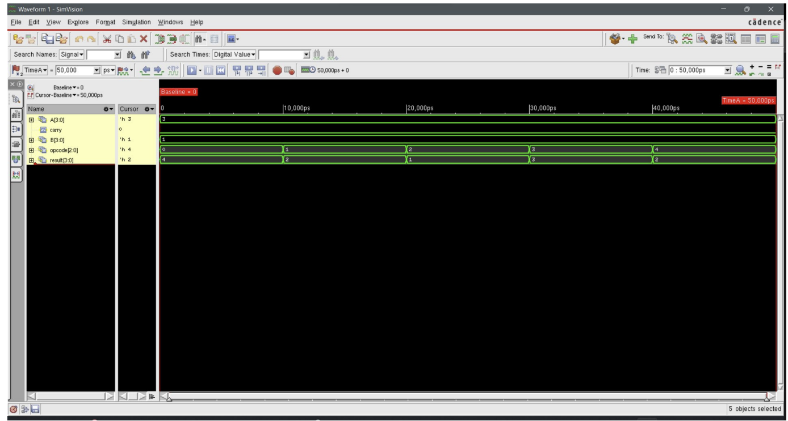
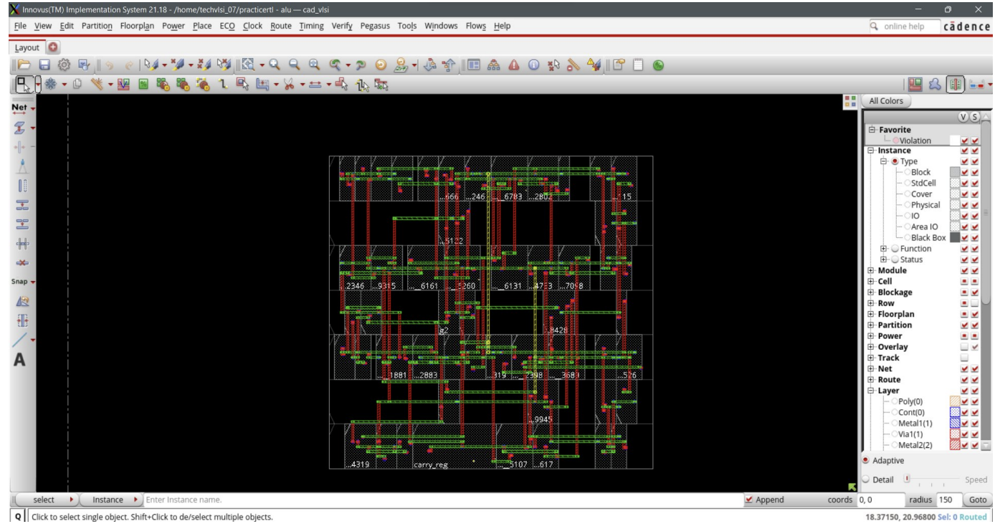
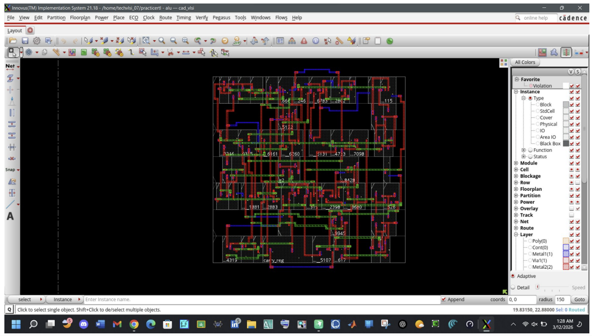
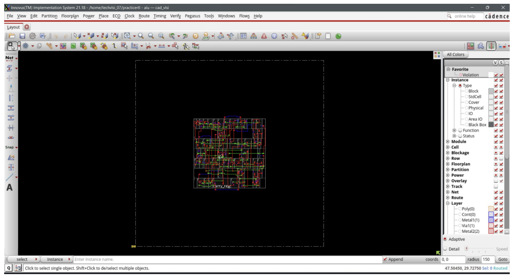

# 4-bit ALU RTL-to-GDSII Implementation (Cadence)
> Complete RTL-to-GDSII ASIC implementation using Cadence Genus & Innovus with successful routing and zero DRC violations.
## Overview

This project implements a 4-bit Arithmetic Logic Unit (ALU) and takes it through the complete ASIC design flow — from Verilog RTL all the way to a final GDSII layout.

The goal was to understand how a digital design moves from code to physical silicon using industry tools like Cadence Genus and Innovus.

---

## Tools Used

* Cadence Genus – synthesis
* Cadence Innovus – physical design
* Cadence Xcelium – simulation
* Linux (RHEL/CentOS)

---

## Design Flow

RTL → Simulation → Synthesis → Gate-Level Simulation → Floorplan → Placement → Routing → DRC → GDSII

---

## ALU Functionality

The ALU is a combinational design supporting:

* Addition
* Subtraction
* AND
* OR
* XOR

It also generates a carry/borrow output for arithmetic operations.

---

## Results

* Routing completed successfully
* No DRC violations
* RTL and gate-level simulations matched

---

## Project Structure

```
rtl/           Verilog design  
tb/            Testbench  
constraints/   SDC file  
synthesis/     Netlist + reports  
gds/           Final layout  
docs/          Full report  
images/        Screenshots  
```

---

## Results & Screenshots

### RTL Simulation



### Gate-Level Simulation



### Placement (Innovus)



### Routing



### Final GDS Layout



---

## Report

Full project report:
docs/report.pdf

---

## What I Learned

* Complete RTL to GDSII flow
* Using Cadence tools for synthesis and P&R
* Debugging synthesis and simulation issues
* Understanding physical design stages

---

## Author

Siam Al Shafin

